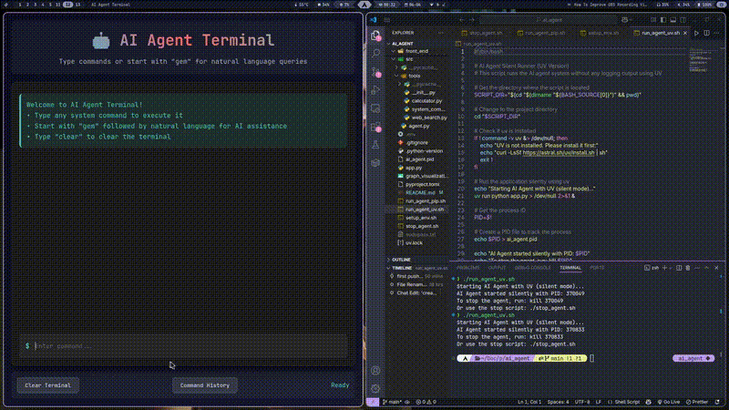
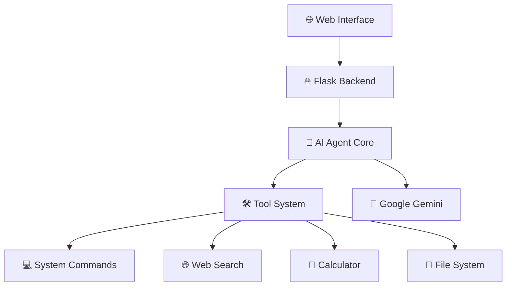

<div align="center">

# 🤖 AI Agent Terminal


### *Intelligent Terminal Assistant with AI-Powered Command Execution*

[](https://python.org)
[](https://flask.palletsprojects.com)
[](https://langchain.com)
[](https://ai.google.dev/)

<br>

*🚀 Experience the future of terminal interaction with AI-powered command execution, web search capabilities, and intelligent assistance.*

---

</div>

## ✨ Features

<table>
<tr>
<td width="50%">

### 🎯 **Smart Command Execution**
- Execute system commands with AI assistance
- Intelligent command interpretation
- Cross-platform compatibility
- Real-time command feedback

</td>
<td width="50%">

### 🌐 **Web-Powered Intelligence**
- Live web search integration
- Real-time information retrieval
- Current events and facts
- Intelligent content parsing

</td>
</tr>
<tr>
<td width="50%">

### 🧮 **Built-in Calculator**
- Mathematical computations
- Complex calculations
- Formula evaluation
- Scientific operations

</td>
<td width="50%">

### 🖥️ **Modern Web Interface**
- Beautiful terminal UI
- Responsive design
- Command history
- Real-time status updates

</td>
</tr>
</table>

---

## 🎬 Demo

<div align="center">

### 📹 **Watch AI Agent in Action**



*🎥 Live demo showcasing all features*

> **📺 Full Video**: Check out the complete demo video at [`demo/demo.mp4`](./demo/demo.mp4)

</div>

---

## 🚀 Quick Start

### Prerequisites

<div align="center">


</div>

### 🔧 Installation Options

<details>
<summary><b>🔥 Option 1: Quick Setup with UV (Recommended)</b></summary>

```bash
# 1. Clone the repository
git clone <your-repo-url>
cd ai_agent

# 2. Set up environment and install dependencies
chmod +x setup_env.sh
./setup_env.sh

# 3. Configure your Google AI API key
echo "GOOGLE_API_KEY=your_api_key_here" > .env

# 4. Run the application
chmod +x run_agent_uv.sh
./run_agent_uv.sh
```

</details>

<details>
<summary><b>🐍 Option 2: Traditional pip Setup</b></summary>

```bash
# 1. Clone and navigate
git clone <your-repo-url>
cd ai_agent

# 2. Create virtual environment
python -m venv venv
source venv/bin/activate  # On Windows: venv\Scripts\activate

# 3. Install dependencies
pip install -e .

# 4. Set up API key
echo "GOOGLE_API_KEY=your_api_key_here" > .env

# 5. Run the application
chmod +x run_agent_pip.sh
./run_agent_pip.sh
```

</details>

### 🔑 Get Your Google AI API Key

1. Visit [Google AI Studio](https://aistudio.google.com/app/apikey)
2. Create a new API key
3. Copy the key to your `.env` file

---

## 🎮 Usage Guide

### 🤖 Natural Language Commands

Start any command with `gem` to use AI assistance:

```bash
gem what files are in this directory?
gem how much disk space do I have?
gem search for information about Python programming
gem calculate 15% of 250
```

### 💻 Direct System Commands

Execute any system command directly:

```bash
ls -la
pwd
ps aux
df -h
git status
python --version
```

### 🌟 Special Commands

| Command | Description | Example |
|---------|-------------|---------|
| `clear` | Clear terminal | `clear` |
| `help` | Show help | `help` |
| `history` | Command history | Click History button |

---

## 🏗️ Architecture

<div align="center">



</div>

### 🔧 Core Components

- **Flask Web Server**: Modern HTTP server with WebView integration
- **AI Agent Core**: LangGraph-powered intelligent agent
- **Tool System**: Modular tool architecture for extensibility
- **Google Gemini**: Advanced language model for natural language processing

---

## 📁 Project Structure

```
ai_agent/
├── 🎯 app.py                 # Flask web application
├── 📋 pyproject.toml         # Project configuration
├── 🌐 front_end/             # Web interface
│   ├── index.html           # Main HTML page
│   ├── script.js            # JavaScript logic
│   └── style.css            # Styling
├── 🤖 src/                   # Core source code
│   ├── agent.py             # AI agent implementation
│   └── 🛠️ tools/             # Tool modules
│       ├── calculator.py    # Mathematical operations
│       ├── system_commands.py # System command execution
│       └── web_search.py    # Web search functionality
└── 🚀 Scripts/               # Utility scripts
    ├── setup_env.sh         # Environment setup
    ├── run_agent_uv.sh      # UV runner
    ├── run_agent_pip.sh     # Pip runner
    └── stop_agent.sh        # Stop application
```

---

## 🛠️ Development

### 🔨 Adding New Tools

Create a new tool in `src/tools/`:

```python
# src/tools/my_new_tool.py
from langchain_core.tools import tool

@tool
def my_new_tool(query: str) -> str:
    """Description of what this tool does."""
    # Your implementation here
    return result
```

Register in `src/tools/__init__.py`:

```python
from .my_new_tool import my_new_tool
```

### 🧪 Testing

```bash
# Run tests (if implemented)
python -m pytest

# Manual testing
./run_agent_uv.sh
# Open browser to http://localhost:5000
```

---

## 🔒 Security Notes

⚠️ **Important Security Considerations:**

- This application can execute system commands
- Only run in trusted environments
- Review commands before execution in production
- Consider implementing command whitelisting for production use

---

## 🤝 Contributing

We welcome contributions! Here's how to get started:

1. **Fork** the repository
2. **Create** a feature branch: `git checkout -b feature/amazing-feature`
3. **Commit** changes: `git commit -m 'Add amazing feature'`
4. **Push** to branch: `git push origin feature/amazing-feature`
5. **Open** a Pull Request

---

## 📄 License

This project is licensed under the MIT License - see the [LICENSE](LICENSE) file for details.

---

## 🙏 Acknowledgments

<div align="center">

**Built with ❤️ using:**

[](https://langchain.com)
[](https://ai.google.dev/)
[](https://flask.palletsprojects.com)

---

 *Crafted with precision and passion for AI-powered productivity*

</div>
